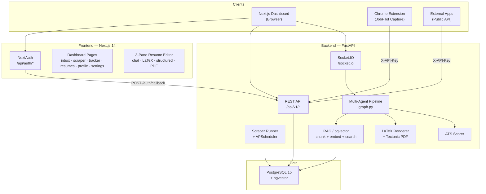
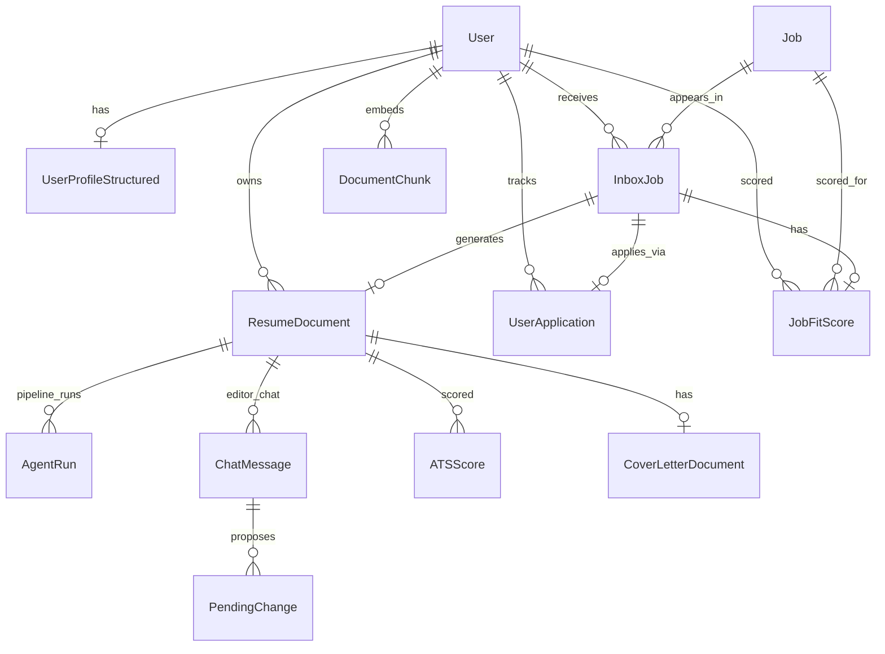
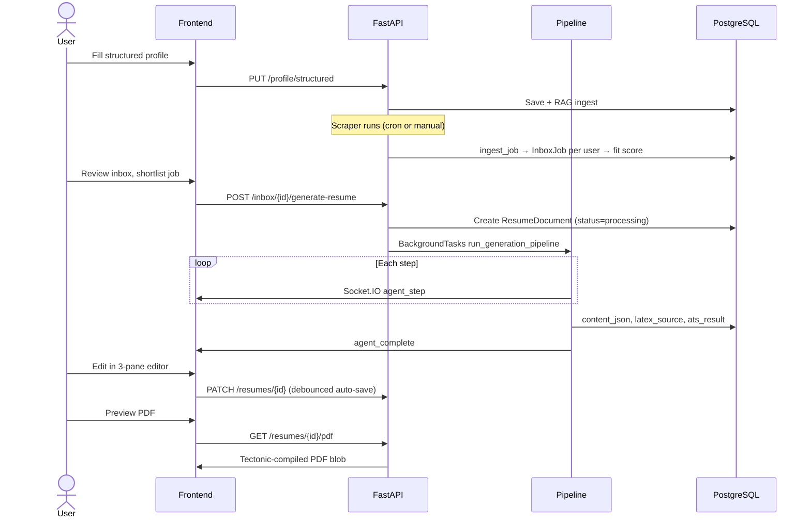

# JobPilot — Architecture & Improvement Guide

> **Purpose of this document:** Explain what JobPilot actually does today (not just what the README promises), how the pieces connect, where fragmentation and bugs come from, and how to evolve it from a feature-rich prototype into a reliable product.

**Last updated:** June 2026  
**Live demo:** [jobs.nevil.ca](https://jobs.nevil.ca)

---

## Table of Contents

1. [What JobPilot Is](#1-what-jobpilot-is)
2. [Why It Feels Fragmented](#2-why-it-feels-fragmented)
3. [System Overview](#3-system-overview)
4. [Monorepo Layout](#4-monorepo-layout)
5. [Backend Architecture](#5-backend-architecture)
6. [Database Model](#6-database-model)
7. [Core User Flows](#7-core-user-flows)
8. [Frontend Architecture](#8-frontend-architecture)
9. [Chrome Extension](#9-chrome-extension)
10. [Infrastructure & Deployment](#10-infrastructure--deployment)
11. [Known Bugs & Fragile Areas](#11-known-bugs--fragile-areas)
12. [How to Make It Better](#12-how-to-make-it-better)
13. [Recommended Phased Plan](#13-recommended-phased-plan)

---

## 1. What JobPilot Is

JobPilot is an **open-source, self-hosted job search command centre** aimed at Canadian tech job seekers (AB, BC, ON, SK). It combines four product areas that are **partially integrated**:

| Product area | What it does | Maturity |
|--------------|--------------|----------|
| **Job discovery** | Scrapes job boards, normalizes listings, filters for Canada-eligible roles | Working, but dual scraper stacks |
| **Job Inbox** | Per-user inbox with AI fit scoring, status workflow, resume category recommendations | Core v0.4 feature — mostly complete |
| **Application tracker** | Kanban board (To Apply → Applied → Interviewing → Offer → Rejected) | Working |
| **AI resume builder** | Multi-step LLM pipeline: analyze JD → research company → tailor resume → cover letter → ATS score → LaTeX PDF | Core differentiator — works with BYOK keys, fragile without them |

**Business model:** Users bring their own LLM API keys (BYOK). The server stores keys encrypted and runs the pipeline per user. No server-side LLM billing.

**North star (from ROADMAP):** Apply faster to higher-fit Canadian technical jobs and get interviews — not maximize job volume.

### What actually works end-to-end today

1. User signs in (GitHub/Google OAuth, or `AUTH_DISABLED=true` for local dev).
2. User fills a **structured profile** (`/profile`) — experience, education, skills, projects.
3. User configures an **LLM API key** in Settings (required for AI tailoring).
4. Jobs enter the system via **scrapers**, **URL import**, **manual entry**, or **Chrome extension capture**.
5. Jobs appear in **Inbox** with fit scores (if profile has enough evidence).
6. User shortlists a job → **Generate Tailored Resume** → multi-agent pipeline runs → 3-pane editor opens.
7. User edits resume (structured form, LaTeX, or AI chat diffs) → PDF preview via Tectonic.
8. User tracks applications on the **Kanban board**.

### What is aspirational or incomplete

- **Community** page — placeholder only (`/community`).
- **Notifications / push** — DB fields and config exist, no API or UI.
- **Gmail forward import** — config only, not implemented.
- **Company watchlist** — planned in ROADMAP Phase 6, not built.
- **Full-text search** (`jobs.search_vector`) — column exists, never populated.
- **Data retention jobs** — config exists, no cleanup cron.

---

## 2. Why It Feels Fragmented

JobPilot grew in **layers** (v0.1 MVP → v0.4 Job Intelligence → extension → cover letters). Each layer added features without fully consolidating the previous ones. Specific causes:

### A. Three parallel job-ingestion paths

```
Scrapers (legacy + new adapters)
    ↓
URL importer (Playwright + BeautifulSoup)     ← different code from extension
    ↓
Chrome extension (client-side DOM extraction) ← different selectors again
    ↓
Manual inbox entry
```

All converge on `ingest_job()` but with **no shared extraction library**.

### B. Two scraper architectures running in parallel

| Legacy (`app/scrapers/`) | Modern (`app/jobs/sources/`) |
|--------------------------|--------------------------------|
| RemoteOK, WeWorkRemotely, Hacker News | Job Bank, Adzuna, JSearch |
| `RawJob` + `JobSource` enum | `CanadianJobSource` + `NormalizedJob` |

Both are invoked from `scraper_runner.py`. Migration is acknowledged in docs but not finished.

### C. Dual schema management

Database schema is defined in **three places**:

1. **Alembic migrations** (`backend/alembic/versions/`)
2. **`Base.metadata.create_all`** on every startup (`main.py` → `init_db()`)
3. **Raw `ALTER TABLE ... ADD COLUMN IF NOT EXISTS`** guards in `init_db()`

This makes it hard to know the canonical schema and easy for environments to drift.

### D. Dual content representations for resumes

Every resume has:

- `content_json` — structured Pydantic `ResumeContent` (source of truth for AI)
- `latex_source` — rendered LaTeX string (source of truth for PDF export)

These can **drift** when the user edits one without regenerating the other. Export prefers stored LaTeX if non-empty, so PDF can show stale content.

### E. Frontend/backend contract is manual

- Backend: `backend/app/schemas/resume_content.py` (Pydantic)
- Frontend: `frontend/types/resume.ts` (TypeScript)

No code generation or shared OpenAPI client — types can silently diverge.

### F. Three auth modes

| Mode | Used by |
|------|---------|
| `AUTH_DISABLED=true` | Local dev — auto-provisions `dev@jobpilot.local` |
| JWT Bearer (NextAuth → `/auth/callback`) | Dashboard UI |
| `X-API-Key` (hashed tokens) | Chrome extension, public `/documents` API |

### G. In-process background work

The resume pipeline runs via FastAPI `BackgroundTasks` — **no job queue**. Server restart kills in-flight pipelines. Progress is recovered only via DB polling or Socket.IO if the client is connected.

### H. O(users × jobs) inbox fan-out

When scrapers ingest a new job, **every registered user** gets an `InboxJob` row and fit score computed. This does not scale beyond a small user base.

### I. Frontend gaps

- No global state management (React Query, etc.) — every page fetches independently.
- Error handling is inconsistent (`alert()`, silent `console.error`, or inline toasts).
- `/inbox` and `/extension` are **not in auth middleware** — pages render without login when auth is enabled.
- Socket.IO has no auth token — anyone who knows a resume UUID could join its room.
- Cover letter pipeline uses polling; resume pipeline uses Socket.IO — inconsistent UX.

---

## 3. System Overview



### Request paths (production)

```
Internet → Nginx :443
  ├── /api/auth/*   → Next.js :3000  (NextAuth OAuth)
  ├── /api/v1/*     → FastAPI :8000  (business logic)
  ├── /socket.io/*  → FastAPI :8000  (pipeline progress)
  └── /*            → Next.js :3000  (UI)
```

Database: Neon PostgreSQL in production; local Docker Postgres in dev.

---

## 4. Monorepo Layout

```
JobPilot/
├── backend/           FastAPI app — all business logic
│   ├── app/
│   │   ├── main.py              Entry: routers, init_db, scheduler, socket_app
│   │   ├── api/routes/          14 REST routers (~80 endpoints)
│   │   ├── api/schemas/         Pydantic request/response models (split package)
│   │   ├── agents/              LLM pipeline + editor chat + validation
│   │   ├── core/                auth, config, database, migrations, scheduler
│   │   ├── jobs/                Job Intelligence: ingest, dedup, scoring, sources
│   │   ├── models/              SQLAlchemy ORM (15+ tables)
│   │   ├── schemas/             Domain schemas (ResumeContent, etc.)
│   │   ├── scrapers/            Legacy scrapers + URL importer + company research
│   │   ├── services/            resume, rag, llm, ats, scraper_runner, webhooks
│   │   └── sockets/             Socket.IO server
│   ├── alembic/                 DB migrations (002–006 substantive; 001 noop)
│   └── tests/unit/              26 unit test files — no integration suite
│
├── frontend/          Next.js 14 App Router
│   ├── app/
│   │   ├── (marketing)/         Public landing page
│   │   └── (dashboard)/         Authenticated app shell
│   ├── components/              UI, resume editor, tracker, scraper
│   ├── lib/api.ts               Typed fetch client to backend
│   └── middleware.ts            Route protection (incomplete matcher)
│
├── extension/         Chrome MV3 — JobPilot Capture (manual install only)
├── deploy/linode/     Production: systemd, nginx, rsync deploy scripts
├── scripts/           dev.sh, ensure-tectonic.sh
└── docker-compose.yml Optional full-stack Docker (dev.sh uses Postgres-only Docker)
```

---

## 5. Backend Architecture

### 5.1 Entry point

**File:** `backend/app/main.py`

On startup (lifespan):

1. Run Alembic migrations
2. `init_db()` — extensions, `create_all`, ad-hoc ALTER TABLE, Canada backfill
3. Start APScheduler (scrape cron, stale pipeline sweep)

ASGI app: `socket_app = socketio.ASGIApp(sio, other_asgi_app=app)` — Socket.IO wraps FastAPI.

### 5.2 API routers

| Prefix | Router | Auth | Purpose |
|--------|--------|------|---------|
| `/api/v1` | health | None | Health check |
| `/api/v1/auth` | auth | None | OAuth callback → JWT |
| `/api/v1/jobs` | jobs | Mixed | Job catalog search + URL import |
| `/api/v1/inbox` | inbox | JWT | Job Intelligence inbox |
| `/api/v1/applications` | applications | JWT | Kanban tracker |
| `/api/v1/scraper` | scraper | JWT | Trigger scrapes, source settings |
| `/api/v1/profile` | profile | JWT | Structured profile, PDF upload |
| `/api/v1/analytics` | analytics | JWT | Dashboard stats |
| `/api/v1/settings` | settings | JWT | BYOK keys, API tokens |
| `/api/v1/resumes` | resumes | JWT | Resume CRUD, pipeline, editor chat, ATS |
| `/api/v1/cover-letters` | cover_letters | JWT | Cover letter CRUD + chat |
| `/api/v1/documents` | documents_api | X-API-Key | Public API wrapper for resumes |
| `/api/v1/internal` | internal | CRON_SECRET | Production scrape trigger |
| `/api/v1/extension` | extension | X-API-Key | Chrome extension capture |

### 5.3 Multi-agent resume pipeline

**File:** `backend/app/agents/graph.py`

**Trigger:** `POST /resumes`, inbox `generate-resume`, regenerate endpoints.

```
ingest_context → analyze_jd → research_company → tailor_resume → cover_letter → ats_score
```

| Step | LLM? | RAG? | Output |
|------|------|------|--------|
| ingest_context | — | Ingests JD + upload into chunks | — |
| analyze_jd | Yes (skip if no key) | — | `jd_analysis` in insights_json |
| research_company | Yes (URL scrape + enrich) | Ingests company text | `company_research` |
| tailor_resume | Yes | `search_chunks()` top 6 | Guarded `content_json` |
| cover_letter | Optional | — | `CoverLetterDocument` |
| ats_score | Rule-based scorer | — | `ATSScore` row |

**Modes:** `full`, `tailor_only`, `cover_letter_only`.

**Guard:** `agents/validation.py` strips fabricated employers, institutions, metrics from LLM output.

**Real-time:** Emits Socket.IO events to room `resume:{id}`:

- `agent_step` — step name + status (running/completed/failed)
- `agent_complete` — pipeline done
- `agent_error` — failure with error message

**Failure:** Sets `resume.status = "failed"`, writes `pipeline_error` to insights_json, optional webhook.

**Without LLM key:** Pipeline skips AI steps; resume uses profile data as-is. This is a common source of "it doesn't work" confusion.

### 5.4 Resume rendering & PDF

| Stage | File |
|-------|------|
| Schema | `schemas/resume_content.py` |
| JSON → LaTeX | `services/resume/renderer.py` + `latex_preamble.py` (Jake's Resume template) |
| JSON → HTML | `renderer.render_resume_html()` (preview only) |
| LaTeX → PDF | `services/resume/pdf_compiler.py` via Tectonic subprocess |
| Fallback PDF | Plain-text PDF if Tectonic missing or compile fails |

PDF is compiled **on demand** at `GET /resumes/{id}/pdf` — not stored in DB.

### 5.5 RAG system

**Files:** `services/rag/chunker.py`, `services/rag/ingest.py`

- Chunks: 800 chars, 100 overlap; also structured resume sections.
- Storage: `document_chunks` table with pgvector `embedding` (1536-dim).
- Search: pgvector cosine similarity; fallback to keyword scoring over 400 chunks.
- Ingest triggers: pipeline ingest step, company research, profile save, PDF upload.
- Used by: `tailor_resume()`, `editor_agent.py`.

Requires separate embedding model config from chat model.

### 5.6 Job scraping & inbox scoring

**Scraper orchestrator:** `services/scraper_runner.py`  
**Scheduler:** `core/scheduler.py` — 08:00 (+ optional 18:00) America/Toronto

**Sources:**

| Source | Stack | Credentials |
|--------|-------|-------------|
| Job Bank, Adzuna, JSearch | Modern adapters | Env API keys |
| RemoteOK, WWR, HN | Legacy scrapers | Public |

**Ingest flow:**

```
fetch → normalize → dedup (hash + fuzzy) → persist Job → create InboxJob per user → score_inbox_job()
```

**Fit scoring:** `jobs/scoring/engine.py` — weighted rules (skills, experience, location, seniority). Thresholds: <40 low, 40–59 stretch, 60–74 reviewed, 75–84 recommended, 85+ priority.

### 5.7 Auth

**JWT (dashboard):** `core/auth.py`

1. NextAuth OAuth → `POST /auth/callback` with provider info
2. Upsert User → return JWT (`sub` = user.id)
3. Protected routes: `Depends(get_current_user)`

**Dev bypass:** `AUTH_DISABLED=true` returns first DB user or creates `dev@jobpilot.local`.

**API tokens:** `core/api_auth.py` — SHA-256 hash lookup for `X-API-Key: jp_*`.

**BYOK:** Encrypted in `user_api_keys`; resolved per request via `services/llm/client.py`.

---

## 6. Database Model



### Key tables

| Table | Purpose |
|-------|---------|
| `users` | OAuth identity, skills_keywords, encrypted LLM keys |
| `user_profile_structured` | Canonical career data (`content_json`) |
| `jobs` | Global job catalog (normalized, deduped) |
| `inbox_jobs` | Per-user job workflow (status, fit, resume category) |
| `job_fit_scores` | Explainable fit score + risk flags |
| `resume_documents` | Tailored resumes (content_json, latex_source, insights_json, status) |
| `cover_letter_documents` | Cover letters linked to resumes |
| `user_applications` | Kanban tracker entries |
| `document_chunks` | RAG embeddings (pgvector) |
| `agent_runs` | Pipeline step audit log |
| `pending_changes` | AI editor diffs (accept/reject) |
| `ats_scores` | ATS score history |
| `job_sources` / `scraper_runs` | Scraper config and audit |
| `captured_jobs` | Extension capture audit trail |

### Orphan models (no API routes)

- `community_channels`, `community_posts`
- `notifications`

---

## 7. Core User Flows

### 7.1 Profile → Inbox → Resume (happy path)



### 7.2 Chrome extension capture

```
User on LinkedIn/Indeed/etc.
  → Extension extracts job fields (content.js selectors + JSON-LD)
  → POST /extension/capture (X-API-Key)
  → normalize → ingest_job → InboxJob + fit score
  → Optional: PATCH /extension/inbox/{id} (status/category)
```

### 7.3 Kanban tracker

```
Jobs saved via quick-save, inbox "applied", or manual add
  → user_applications table
  → Frontend KanbanBoard (@dnd-kit drag-and-drop)
  → PATCH /applications/{id} on status change
```

---

## 8. Frontend Architecture

### 8.1 Routing

| Route | Page | Notes |
|-------|------|-------|
| `/` | Landing | Public marketing |
| `/login` | OAuth login | Dev shortcut when auth disabled |
| `/dashboard` | Home stats | |
| `/inbox` | Job Inbox | **Not in auth middleware** |
| `/scraper` | Find Jobs | Job catalog + trigger scrape |
| `/tracker` | Kanban | Application board |
| `/resumes`, `/resumes/new`, `/resumes/[id]` | Resume list, create, editor | Editor uses Socket.IO |
| `/resumes/[id]/review` | ATS review | |
| `/cover-letters/*` | Cover letter CRUD + editor | Polls for processing status |
| `/profile` | Structured profile + PDF preview | |
| `/settings` | BYOK keys, scoring prefs, API tokens | |
| `/analytics` | Charts | |
| `/community` | Placeholder | "Coming in v0.2" |
| `/extension` | Extension setup | **Not in auth middleware** |

### 8.2 Auth bridge

```
NextAuth OAuth
  → JWT callback POSTs /auth/callback
  → stores accessToken in JWT session
  → AuthInit copies to localStorage (jobpilot_token)
  → lib/api.ts attaches Authorization: Bearer on every fetch
```

### 8.3 State management

**No global store.** Each page uses local `useState` + `useEffect`. Implications:

- No request caching or deduplication
- Duplicate fetches across navigations
- Resume list polls every 5s regardless of processing state
- Errors often swallowed silently

### 8.4 Resume editor (3-pane)

**File:** `frontend/app/(dashboard)/resumes/[id]/page.tsx`

| Pane | Component | Behavior |
|------|-----------|----------|
| Left | AI chat | sendResumeChat → pending changes accept/reject |
| Center | LaTeX + PDF | CodeMirror editor; debounced PDF preview via blob URL |
| Right | Structured | StructuredEditor form for content_json |

Auto-save: 500ms content_json, 800ms latex_source. Layout hardcodes `left-60` sidebar offset even when sidebar collapsed.

---

## 9. Chrome Extension

**Location:** `extension/` — Manifest V3, manual "Load unpacked" install.

| File | Role |
|------|------|
| `manifest.json` | Permissions: activeTab, storage, scripting, tabs, all_urls |
| `content.js` | Site-specific CSS selectors + JSON-LD JobPosting extraction |
| `popup.js` | Settings, API calls, keyboard shortcut (Cmd/Ctrl+Shift+Y) |

**Supported sites:** LinkedIn, Indeed, Job Bank, Greenhouse, Lever, Workday, generic fallback.

**Not integrated into:** CI, Docker, deploy scripts, or Chrome Web Store.

**Setup:** User creates API token at `/extension`, configures API URL + token in extension popup.

---

## 10. Infrastructure & Deployment

### Three deployment modes (fragmentation source)

| Mode | Command | DB | Package manager |
|------|---------|-----|-----------------|
| Local dev | `./scripts/dev.sh` | Docker Postgres only | **bun** (frontend) |
| Docker full stack | `docker compose up` | Container Postgres | npm |
| Production (Linode) | rsync + systemd | Neon PostgreSQL | npm |

### CI/CD (`.github/workflows/`)

| Workflow | Trigger | Actions |
|----------|---------|---------|
| `ci.yml` | PR + push main | pytest, frontend lint/build, Docker build |
| `deploy.yml` | push main | rsync to Linode, alembic upgrade, restart |
| `scrape.yml` | cron 2×/day | POST `/internal/cron/scrape` |

**Gaps:** No extension CI, no E2E tests, bun vs npm split in dev vs CI.

### External dependencies

| Dependency | Required for | Fallback |
|------------|--------------|----------|
| PostgreSQL + pgvector | Everything | — |
| Tectonic | Real PDF preview | Plain-text PDF |
| User LLM API key | AI tailoring, JD analysis | Profile passthrough only |
| Playwright Chromium | URL importer | Manual entry |
| Scraper API keys (Adzuna, JSearch) | Canadian sources | Legacy public scrapers only |

---

## 11. Known Bugs & Fragile Areas

### High impact (user-visible)

| Issue | Symptom | Root cause |
|-------|---------|------------|
| No LLM key configured | Resume is just profile copy, no tailoring | Pipeline skips AI steps silently |
| Tectonic not installed | Ugly plain-text PDF | `pdf_compiler.py` fallback |
| content_json ↔ latex_source drift | PDF doesn't match structured editor | Export prefers stored latex_source |
| Pipeline killed on restart | Resume stuck in "processing" or "failed" | BackgroundTasks, no queue; 30-min stale sweep |
| `/inbox`, `/extension` unprotected | Pages load without login | middleware.ts matcher omission |
| Auto-save failures silent | "Saving..." stuck, data loss risk | No error toast in resume editor |
| Cover letter processing | No progress UI on mount | Polling only, no Socket.IO |
| Scanned PDF upload | Fails with "not supported yet" | No OCR pipeline |

### Architectural fragility

| Issue | Risk |
|-------|------|
| Dual schema init (Alembic + create_all + ALTER) | Schema drift between environments |
| O(users × jobs) inbox fan-out | Performance collapse as users grow |
| Socket.IO without auth | Room join by UUID guess |
| AUTH_DISABLED in Docker compose | Dangerous if deployed to prod accidentally |
| Canada-only hardcoded (`country="CA"`) | Non-CA users can't use product as-is |
| Semantic ATS in pipeline | Rule-based only; LLM enrichment on manual rescore only |
| Community/notification models | Dead code confusion |

### Test coverage gaps

- **26 unit test files** — good for pure functions (scoring, validation, renderer)
- **No integration tests** for API routes, auth, pipeline, inbox, scraper E2E
- **No frontend tests**
- **`agents/graph.py`** — entire pipeline untested

---

## 12. How to Make It Better

### Principle: Focus the product

JobPilot tries to be a job board, inbox, tracker, resume builder, cover letter generator, public API, and Chrome extension simultaneously. **Pick one wedge and make it flawless:**

> **Recommended wedge:** "Paste a job URL → get a tailored, ATS-scored, PDF-ready resume in 2 minutes."

Everything else (scrapers, inbox fan-out, community, analytics) should support that loop or be deferred.

### 12.1 Consolidate the foundation (Week 1–2)

| Action | Why |
|--------|-----|
| **Single schema source of truth** — Alembic only; remove `create_all` + raw ALTER from startup | Eliminates drift |
| **Single package manager** — pick npm or bun, use everywhere | Dev/CI parity |
| **Fix auth middleware** — add `/inbox`, `/extension` to matcher | Security |
| **Add Socket.IO auth** — validate JWT on connect or room join | Security |
| **Delete or wire orphan models** — community, notifications | Reduce confusion |
| **Remove `schemas_old.py`** if refactor is complete | Dead code |

### 12.2 Fix the resume core loop (Week 2–4)

| Action | Why |
|--------|-----|
| **Always sync latex_source from content_json** on save (or drop dual representation) | Fixes PDF drift — biggest UX bug |
| **Require LLM key before resume creation** with clear UI message | Stops silent failures |
| **Replace BackgroundTasks with a job queue** (Celery, ARQ, or BullMQ via Redis) | Survives restarts, enables retry |
| **Unify real-time progress** — Socket.IO for cover letters too; stop blind polling | Consistent UX |
| **Bundle Tectonic in dev.sh reliably** — fail loudly if missing | PDF quality |
| **Generate TS types from OpenAPI** (`openapi-typescript` from FastAPI schema) | Contract safety |

### 12.3 Consolidate job ingestion (Week 4–6)

| Action | Why |
|--------|-----|
| **Finish scraper migration** — retire legacy `app/scrapers/` or wrap behind modern adapter interface | One code path |
| **Shared job extraction spec** — one JSON schema for extension, URL importer, manual entry | Stop triplicate selectors |
| **Opt-in inbox fan-out** — only create InboxJob for users matching province/prefs, or on-demand | Scalability |
| **Populate or drop `search_vector`** | Dead column |

### 12.4 Frontend quality (Week 4–6)

| Action | Why |
|--------|-----|
| **Add React Query (TanStack Query)** | Caching, dedup, stale-while-revalidate, error states |
| **Global toast system** (sonner or similar) | Replace alert() and silent failures |
| **Error boundaries** on dashboard layout | Graceful degradation |
| **Fix resume editor layout** — respond to sidebar collapse | Polish |
| **Debounced profile PDF preview** | Match resume editor UX |
| **Delete unused API methods** or wire them | Reduce surface area |

### 12.5 Testing & reliability (ongoing)

| Action | Why |
|--------|-----|
| **Integration test suite** with test DB | Catch route/auth/pipeline regressions |
| **Pipeline test** — mock LLM, assert step order + guard behavior | Core product safety |
| **E2E smoke test** (Playwright): profile → create resume → PDF | Confidence to ship |
| **Frontend component tests** for StructuredEditor, PipelineProgressBar | Editor regressions |

### 12.6 Product decisions to make explicitly

| Decision | Options |
|----------|---------|
| **Geography** | Stay Canada-only (document clearly) vs. make country configurable |
| **Multi-tenant scale** | Single-user self-host vs. SaaS with many users (affects inbox fan-out) |
| **Community** | Build it or delete the placeholder |
| **Extension** | Publish to Chrome Web Store or keep dev-only |
| **Job discovery vs. resume builder** | Which is the primary onboarding path? |

---

## 13. Recommended Phased Plan

### Phase 0 — Stabilize (2 weeks)

- [ ] Alembic-only schema management
- [ ] Fix auth middleware gaps
- [ ] latex_source auto-regeneration on content_json save
- [ ] LLM key gate on resume creation with clear UX
- [ ] Global error toasts
- [ ] npm-only (or bun-only) across dev/CI/Docker

### Phase 1 — Reliable resume pipeline (3 weeks)

- [ ] Job queue (ARQ or Celery + Redis)
- [ ] Pipeline integration tests
- [ ] Socket.IO auth + cover letter progress events
- [ ] OpenAPI → TypeScript type generation
- [ ] E2E smoke test

### Phase 2 — Focused job loop (3 weeks)

- [ ] Retire legacy scrapers OR complete adapter migration
- [ ] Shared job extraction contract (extension + backend)
- [ ] Opt-in/scoped inbox creation (not all users × all jobs)
- [ ] Inbox → resume → apply flow polish (one guided wizard)

### Phase 3 — Product polish (4 weeks)

- [ ] React Query migration
- [ ] Resume editor layout fixes
- [ ] Delete dead code (community models, schemas_old, unused config)
- [ ] Extension CI + optional Web Store publish
- [ ] Documentation aligned with actual behavior

### Phase 4 — Growth features (when core is solid)

- [ ] Company watchlist (ROADMAP Phase 6)
- [ ] Gmail import (ROADMAP Phase 7)
- [ ] Notifications
- [ ] Optional SaaS hosting path

---

## Quick Reference — Key Files

| Concern | Path |
|---------|------|
| Backend entry | `backend/app/main.py` |
| Resume pipeline | `backend/app/agents/graph.py` |
| Resume validation | `backend/app/agents/validation.py` |
| LaTeX renderer | `backend/app/services/resume/renderer.py` |
| PDF compiler | `backend/app/services/resume/pdf_compiler.py` |
| Resume content schema | `backend/app/schemas/resume_content.py` |
| Job ingest | `backend/app/jobs/pipeline/ingest.py` |
| Fit scoring | `backend/app/jobs/scoring/engine.py` |
| Scraper runner | `backend/app/services/scraper_runner.py` |
| RAG | `backend/app/services/rag/ingest.py` |
| Auth | `backend/app/core/auth.py`, `backend/app/core/api_auth.py` |
| Socket.IO | `backend/app/sockets/chat.py` |
| Frontend API client | `frontend/lib/api.ts` |
| Resume editor | `frontend/app/(dashboard)/resumes/[id]/page.tsx` |
| Auth middleware | `frontend/middleware.ts` |
| Extension | `extension/content.js`, `extension/popup.js` |
| Local dev | `scripts/dev.sh` |
| Production deploy | `deploy/linode/scripts/deploy.sh` |
| Roadmap | `ROADMAP.md` |

---

## Summary

**JobPilot is not a toy** — it has a real multi-agent resume pipeline, pgvector RAG, LaTeX PDF compilation, explainable job fit scoring, and a working inbox workflow. But it **accumulated features faster than it consolidated architecture**, which creates the fragmented feeling:

- Three job extraction implementations
- Two scraper stacks
- Two resume representations that drift
- Three deployment modes with different tooling
- Background work that doesn't survive restarts
- Frontend that fetches independently with inconsistent error handling

**The path to a useful product** is not adding more features — it is **narrowing the core loop** (job URL → tailored PDF resume), **fixing the drift bugs** (LaTeX sync, LLM key gate, job queue), and **deleting or finishing half-built surfaces** (community, notifications, legacy scrapers).

Do Phase 0 first. Everything else depends on a stable resume pipeline and honest error handling.
