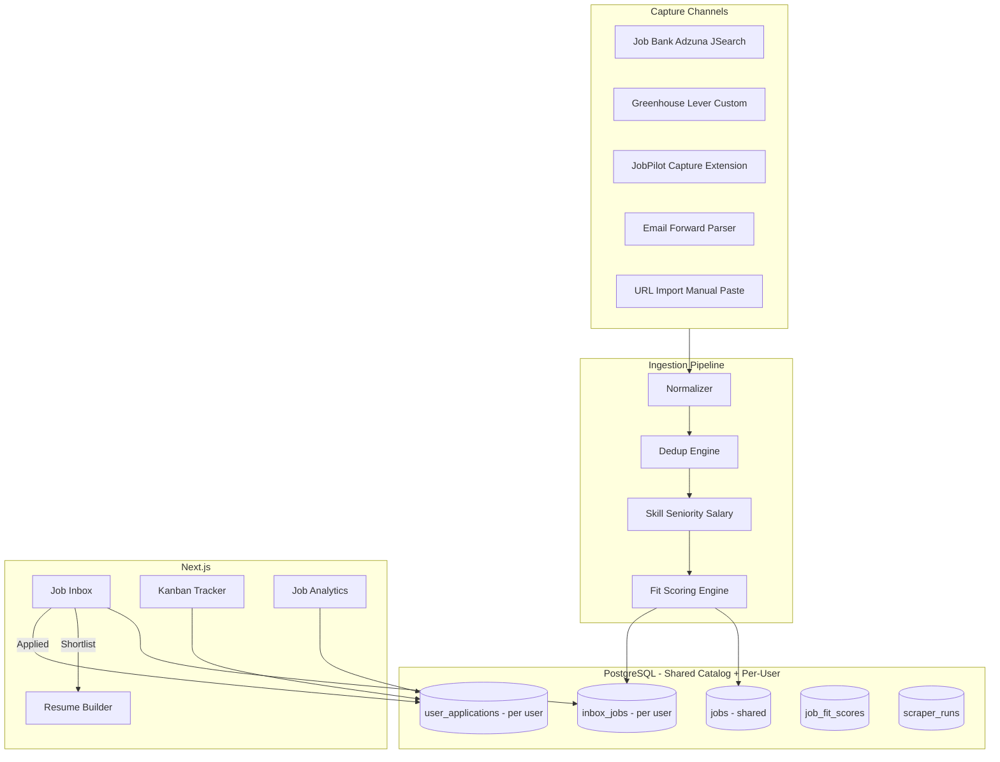

# Job Intelligence + Capture — Implementation Plan

> **Status:** Phases 1–3 implemented — Phase 4 Canadian source adapters are next
> **Database:** PostgreSQL + pgvector (existing JobPilot stack). **No Supabase.**  
> **Source repo:** [canada-tech-job-market-analysis-2026](https://github.com/NevilPatel01/canada-tech-job-market-analysis-2026)  
> **Decisions:** [JOB_INTELLIGENCE_QUESTIONS.md](./JOB_INTELLIGENCE_QUESTIONS.md)

This document is the canonical plan for merging Canadian job acquisition, fit scoring, inbox workflow, extension capture, and application analytics into JobPilot.

**North star:** Help apply faster to **higher-fit Canadian technical jobs** in target provinces and get **interviews** — not maximize job volume.

---

## Goals

1. Collect **real Canadian opportunities** in **AB, BC, ON, SK** via official APIs and permitted sources.
2. Rank jobs by **actual hiring chance** for a work-permit holder targeting PR via tech draws.
3. Shortlist → generate **truthful tailored resumes** faster using existing RAG + multi-agent pipeline.
4. Track applications with **analytics that improve interview rate**.

**Workflow:** discover → shortlist → generate resume → apply → track → follow up → learn.

---

## User Profile & Scoring Context (Confirmed)

| Setting | Value |
|---------|-------|
| Work authorization | Work permit |
| PR strategy | Provincial tech draws |
| Target provinces | Alberta, British Columbia, Ontario, Saskatchewan |
| Relocation | Open to any city in target provinces |
| Top role families | IT Support, Application Support, Cloud/Junior DevOps |

Stored in **User Profile** (`work_authorization`) + **Settings** (scoring thresholds, province weights).

---

## Current State (JobPilot v0.1.x)

| Area | Today | Gap |
|------|-------|-----|
| Job model | Basic `jobs` table | Missing province, city, remote_type, seniority, skills, raw_payload, etc. |
| Scrapers | RemoteOK, WWR, HN | No Job Bank, Adzuna, JSearch, boards, watchlist |
| Dedup | title + company hash | No URL canonicalization, fuzzy match |
| Fit scoring | TF-IDF only | No weighted engine, PR/province signals, resume categories |
| Applications | Kanban auto-from scrapes | Need inbox-first; no application events |
| Capture | URL importer | No extension, Gmail forward |

---

## Target Architecture



### Hybrid data model

| Data | Scope |
|------|-------|
| `jobs` (normalized catalog) | **Shared** across users |
| `inbox_jobs`, `job_fit_scores`, `saved_searches`, `company_watchlist` | **Per-user** |
| `user_applications`, `application_events` | **Per-user** |
| Source API keys | **Instance-level** in `.env` now; **per-user BYOK** later |
| Resume category templates | **Per-user** (seeded on first setup) |

### Backend module layout

```
backend/app/jobs/
├── sources/          # JobSource adapters (ported from old repo collectors)
├── pipeline/         # normalizer, dedup, enrich, ingest
├── scoring/          # engine, rules, resume_categories
├── gmail/            # forward parser (phase 7), OAuth later
├── extension/        # capture endpoint logic
├── scheduler/        # scraper_runs, rate limits, role priority queue
└── retention/        # catalog prune, inbox archive, raw_payload cleanup
```

---

## Normalized Job Contract

Every adapter returns `NormalizedJob` (extends current `RawJob`):

`title`, `company`, `location`, `province`, `city`, `remote_type`, `job_type`, `salary_min`, `salary_max`, `currency`, `description`, `requirements`, `skills`, `seniority`, `experience_min`, `experience_max`, `apply_url`, `source`, `source_job_id`, `posted_date`, `closing_date`, `raw_payload`, `dedupe_hash`

**Province filter for ingestion:** Prefer AB, BC, ON, SK + Remote Canada. Other provinces may be stored but deprioritized in default inbox filters.

---

## Data Model (PostgreSQL)

### Extend `jobs`

`province`, `city`, `remote_type`, `job_type`, `requirements` (JSONB), `skills` (ARRAY), `seniority`, `experience_min`, `experience_max`, `apply_url`, `posted_date`, `closing_date`, `raw_payload` (JSONB), `canonical_url`

### New tables

| Table | Key fields |
|-------|------------|
| `job_sources` | `name`, `enabled`, `rate_limit`, `settings`, `last_success`, `last_error` |
| `inbox_jobs` | `user_id`, `job_id`, `status`, `fit_score_id`, `ai_recommended_category`, `user_selected_category`, `tracker_summary`, `captured_via` |
| `job_fit_scores` | `score`, `label`, `signals`, `matched_skills`, `missing_skills`, `risk_flags`, `recommended_action`, `explanation` |
| `resume_category_templates` | `user_id`, `category`, `base_content` (JSON), `generated_from_profile_at` |
| `scraper_runs` | `source`, `query`, `city`, `status`, counts, `errors`, `duration_ms`, `dry_run` |
| `saved_searches` | per-user filters + alert prefs |
| `company_watchlist` | per-user company, board_type, url, keywords |
| `application_events` | applied, interview, rejection, follow_up_sent, … |
| `captured_jobs` | raw extension/email captures before normalization |
| `user_scoring_prefs` | work_permit, target_provinces, threshold overrides |

### Inbox statuses (final)

`new` → `ai_reviewed` → `shortlisted` → `resume_ready` → `applied` → `archived` | `duplicate`

**Not in inbox:** `interviewing`, `offer`, `rejected` — those live in **Tracker**.

When inbox → `applied`: create/link `UserApplication`. Tracker status changes sync back as `tracker_summary` on inbox row only (e.g. `"Interviewing"`).

### Inbox vs Tracker

| | Inbox | Tracker |
|---|-------|---------|
| **Question** | Is this job worth applying to? | What stage is my application in? |
| **Entry** | Scraper, extension, Gmail, paste, import | User marks Applied or promotes from inbox |
| **Statuses** | Discovery pipeline (ends at Applied) | Application lifecycle |

---

## Source Adapters

| Source | Method | Phase | Policy |
|--------|--------|-------|--------|
| Manual / URL / Paste | Existing + normalized pipeline | **1** | Always available |
| Job Bank Canada | Port `jobbank_collector.py` | **4** | Official API/feed |
| Adzuna Canada | Port `adzuna_collector.py` | **4** | `.env` keys + fallback |
| JSearch | Port `jsearch_collector.py` | **4** | RapidAPI key + fallback |
| RemoteOK | Port + upgrade existing | **4** | Public API |
| RSS | Port `rss_collectors.py` | **4** | Configurable feeds |
| Greenhouse / Lever | Public board APIs | **6** | Watchlist-driven |
| Custom career pages | Configurable URL | **6** | Seed companies without known board |
| LinkedIn / Indeed | Extension + Gmail forward + paste | **5 / 7** | **No aggressive scraping** |
| WWR / HN | Keep existing | **4** | Normalize to new schema |

**API key fallback:** If key missing → skip source, log warning, show "Missing credentials" in Source Settings. Never crash the scheduler.

### Role priority when rate-limited

1. IT Support / End User Support  
2. Application Support / Technical Analyst  
3. Cloud Support / Junior DevOps  
4. Full-stack / Web Developer  
5. Automation / SCADA-adjacent  
6. QA  
7. Data Analyst  

### Default geography (seed queries)

Hamilton, Burlington, Toronto, Mississauga, Oakville, Kitchener, Waterloo, Ottawa, Calgary, Regina, Saskatoon, Vancouver, Remote Canada — all within or across **AB, BC, ON, SK** focus.

### Seed watchlist companies

RBC, TD, Scotiabank, CIBC, BMO, Manulife, Sun Life, Shopify, OpenText, PointClickCare, Geotab, D2L, ApplyBoard, Vidyard, Faire, Wealthsimple, Bell, Rogers, Telus, City of Hamilton, McMaster University, Mohawk College, University of Waterloo, Hamilton Health Sciences.

---

## Dedup Strategy

1. **Canonical URL** — strip tracking params, normalize host.
2. **Company + title + city** — extended hash.
3. **Fuzzy description** — similarity threshold → inbox `duplicate`, link `canonical_job_id`.

---

## Fit Scoring Engine (0–100)

| Signal | Weight | Notes |
|--------|--------|-------|
| Skill match | 25% | Profile + RAG vs JD |
| Experience match | 15% | Years vs JD range |
| Seniority match | 10% | Penalize senior-only for target roles |
| Province / location | 15% | Boost AB/BC/ON/SK; relocation-friendly |
| Remote eligibility | 10% | remote_type + work permit context |
| PR / work permit usefulness | 10% | Tech draw alignment, sponsorship flags |
| Job quality | 10% | Salary, description, source reputation |
| Application friction | 3% | Portal complexity |
| Resume customizability | 2% | Category fit |

### Score labels (defaults, user-configurable)

| Score | Label | Inbox behavior |
|-------|-------|----------------|
| &lt; 40 | Low match | Hidden from high-match filter |
| 40–59 | Stretch / Maybe | Visible, not recommended |
| 60–74 | AI Reviewed | Auto-flag for review |
| 75–84 | Recommended | Shortlist candidate |
| 85+ | Priority Apply Today | Top sort |

### Hard risk flags (filters)

- `senior_only` — 8+ years, lead/principal required
- `non_canada_eligible` — outside target provinces / explicit no work permit
- `unrealistic_experience` — JD vs profile gap &gt; threshold
- `low_skill_match` — below minimum skill overlap

### Resume categories + templates

| ID | Category | Seed template contents |
|----|----------|------------------------|
| `it_support` | IT Support / End User Support | Summary, helpdesk skills, support experience bullets, optional projects |
| `cloud_junior_devops` | Cloud Support / Junior DevOps | Cloud/infra skills, NOC/incident experience |
| `fullstack_web` | Full-stack / Web Developer | Dev stack, project highlights |
| `app_support_analyst` | Application Support / Technical Analyst | App support, troubleshooting, ticketing |
| `automation_scada` | Automation / SCADA-adjacent | PLC/automation if in profile only |

- Templates created from **structured profile** on first setup or category first-use.
- **Never invent experience** — omit sections if profile lacks data.
- Store `ai_recommended_category` + `user_selected_category` on `inbox_jobs` and `job_fit_scores`.

---

## Chrome Extension — JobPilot Capture

| Item | Detail |
|------|--------|
| Location | `extension/` (Manifest V3) |
| Distribution | Unpacked dev first; store-ready structure |
| Auth | `X-API-Key` → `POST /api/v1/extension/capture` |
| Storage | No profile/resume data locally |
| UI | Dark zinc/indigo popup: saved, duplicate, fit score, resume type, Open / Generate / Applied / Archive |
| Extraction | LinkedIn, Indeed, Job Bank, Greenhouse, Lever, Workday-ish, generic DOM + selected-text fallback |

---

## Gmail Import

**Phase 7 (MVP):** Email forward parser

- Inbound address: `jobs+{user_token}@yourdomain.com` (or configurable)
- Parsers: LinkedIn, Indeed, Job Bank, recruiter emails
- Feature flag: `GMAIL_FORWARD_ENABLED`

**Phase 9 (later):** Gmail OAuth label import for LinkedIn, Glassdoor, Adzuna, company alerts.

Modular under `backend/app/jobs/gmail/` — disable without affecting core scrapers.

---

## Resume Builder Integration (Phase 3)

From inbox (`shortlisted` or `resume_ready`):

1. Show AI-recommended category; user can override.
2. Load matching `resume_category_template` (or generate seed from profile).
3. Run existing `app/agents/graph.py` pipeline with `inbox_job_id`, `resume_category`.
4. Output: tailored summary, skills, bullets, cover letter draft, ATS score.
5. Save `ResumeDocument` linked to `job_id` + `inbox_job_id` + `user_application_id`.
6. UI: **"Why this resume version"** + **matched keywords** vs **missing keywords** (JD gaps, not fake skills).

---

## Application Analytics (Phase 8)

- Applications/week, response rate, interview rate
- Best resume **category**, best sources, best cities/provinces
- Common missing skills across fit scores
- Avg posted → applied time
- **Weekly report** (`/job-analytics/report`): apply more / stop applying / top blocking skills

### Follow-up reminders

- In-app notifications only (email later)
- **5 business days** after apply → first reminder
- **10 business days** → optional second reminder
- Recruiter email apps → follow-up draft; ATS-only → status check reminder

---

## Scheduling & Reliability

| Setting | Value |
|---------|-------|
| Timezone | `America/Toronto` |
| Primary cron | 08:00 daily |
| Optional cron | 18:00 daily |
| Primary scheduler | APScheduler (backend always-on) |
| Backup | GitHub Actions workflow → `POST /api/v1/scraper/run` |

Features: `scraper_runs` audit, per-source enable/disable, rate limits, retries (max 3, exponential backoff), dry-run mode.

---

## Data Retention

| Data | Default | Configurable |
|------|---------|--------------|
| Inactive catalog jobs | 180 days | `JOB_CATALOG_RETENTION_DAYS` |
| Applied jobs + history | Forever | User delete only |
| Stale inbox items | Archive after 45 days | `INBOX_AUTO_ARCHIVE_DAYS` |
| `raw_payload` | Prune after 45 days | `RAW_PAYLOAD_RETENTION_DAYS` |

Scheduled cleanup job in `backend/app/jobs/retention/`.

---

## Frontend Pages

| Route | Phase |
|-------|-------|
| `/inbox` | 1 |
| `/saved-searches` | 4 |
| `/sources` | 4 |
| `/watchlist` | 6 |
| `/extension` | 5 |
| `/gmail-import` | 7 |
| `/scraper-runs` | 4 |
| `/job-analytics` | 8 |

**Nav order:** Home → **Inbox** → Profile → Resumes → Cover Letters → Sources → Watchlist → Tracker → Job Analytics → Settings.

`/scraper` redirects to `/inbox` after migration.

---

## Implementation Phases (Confirmed Order)

### Phase 1 — Inbox + Normalized Model + Manual Import

- Migration `002_job_intelligence`
- `NormalizedJob` + pipeline skeleton
- Job Inbox API + UI
- Manual paste + URL import → pipeline
- Stop auto-creating applications from scrapes
- User scoring prefs (work permit, provinces)
- Tests: dedup, normalization

### Phase 2 — Fit Scoring Engine

- Weighted scorer + risk flags + labels
- Inbox fit columns + filters
- Resume category recommender
- Tests: scoring

### Phase 3 — Resume Generate from Inbox

- Seed category templates from profile
- Generate tailored resume flow + category override
- Resume ↔ inbox ↔ tracker linkage
- Tests: resume linkage

### Phase 4 — Job Bank + Adzuna + JSearch

- Port collectors from old repo
- `job_sources`, `scraper_runs`, scheduler (08:00/18:00 Toronto)
- Source Settings UI + env fallback
- Role priority queue
- Tests: source fixtures

### Phase 5 — Chrome Extension

- JobPilot Capture MV3 + capture API
- Extension setup page
- Tests: capture endpoint

### Phase 6 — Company Watchlist + Boards

- Greenhouse, Lever, custom adapters
- Watchlist UI + seed data

### Phase 7 — Gmail Forward Import

- Inbound email parser (LinkedIn, Indeed, Job Bank, recruiters)

### Phase 8 — Weekly Analytics Report

- Application events, job analytics, follow-up reminders
- Tracker ↔ inbox summary sync

### Phase 9 — Hardening + Gmail OAuth

- GitHub Actions backup cron
- Retention jobs
- Per-user API keys
- Gmail OAuth (later)

---

## Environment Variables

```bash
# Job Intelligence master switch
JOB_INTELLIGENCE_ENABLED=true

# Target provinces (comma-separated codes)
TARGET_PROVINCES=AB,BC,ON,SK

# Adzuna Canada (instance-level; per-user later)
ADZUNA_APP_ID=
ADZUNA_APP_KEY=
ADZUNA_COUNTRY=ca

# JSearch / RapidAPI
RAPIDAPI_KEY=
JSEARCH_HOST=jsearch.p.rapidapi.com

# Job Bank (if required)
JOB_BANK_API_KEY=

# Scraper schedule (America/Toronto)
SCRAPER_TIMEZONE=America/Toronto
SCRAPER_MORNING_CRON=0 8 * * *
SCRAPER_EVENING_CRON=0 18 * * *
SCRAPER_EVENING_ENABLED=true
SCRAPER_DRY_RUN=false

# Role keywords (priority order implicit in scheduler)
SCRAPER_DEFAULT_KEYWORDS=IT Support,Application Support,Cloud Support,Full Stack Developer

# Fit scoring thresholds (user can override in Settings)
FIT_SCORE_LOW_MAX=40
FIT_SCORE_STRETCH_MAX=59
FIT_SCORE_REVIEWED_MAX=74
FIT_SCORE_RECOMMENDED_MAX=84

# Gmail forward (phase 7)
GMAIL_FORWARD_ENABLED=false
GMAIL_INBOUND_DOMAIN=yourdomain.com

# Gmail OAuth (phase 9)
GMAIL_OAUTH_ENABLED=false
GMAIL_CLIENT_ID=
GMAIL_CLIENT_SECRET=

# Data retention
JOB_CATALOG_RETENTION_DAYS=180
INBOX_AUTO_ARCHIVE_DAYS=45
RAW_PAYLOAD_RETENTION_DAYS=45

# Follow-up reminders
FOLLOWUP_FIRST_BUSINESS_DAYS=5
FOLLOWUP_SECOND_BUSINESS_DAYS=10
```

**Fallback behavior:** Empty API keys → source disabled in runtime + visible in Source Settings. App continues with remaining sources.

---

## Migration from Old Repo

| Old (`canada-tech-job-market-analysis-2026`) | JobPilot |
|-----------------------------------------------|----------|
| `src/collectors/jobbank_collector.py` | `jobs/sources/job_bank.py` |
| `src/collectors/adzuna_collector.py` | `jobs/sources/adzuna.py` |
| `src/collectors/jsearch_collector.py` | `jobs/sources/jsearch.py` |
| `src/collectors/remoteok_collector.py` | `jobs/sources/remoteok.py` |
| `src/collectors/rss_collectors.py` | `jobs/sources/rss.py` |
| `src/collectors/base_collector.py` | `jobs/sources/base.py` |
| `src/processors/*` | `jobs/pipeline/enrich.py` |
| `src/ai/*` | Defer — use JobPilot RAG/agents |
| `streamlit_app.py` | **Not ported** |
| Supabase / `src/database/` | **Not ported** |

---

## Testing Strategy

| Area | Tests |
|------|-------|
| Dedup | URL canonicalization, fuzzy threshold, cross-source |
| Normalization | Per-source fixtures → `NormalizedJob` |
| Fit scoring | Province boost, risk flags, labels, category mapping |
| Extension capture | Auth, validation, duplicate |
| Inbox filters | Province, remote, high-match, risk flags |
| Resume linkage | inbox → generate → resume + application IDs |
| Retention | Archive + prune jobs |

---

## Non-Goals

- Supabase
- Streamlit app
- Aggressive LinkedIn/Indeed scraping
- Removing resume builder or Kanban
- Collecting thousands of low-fit jobs

---

## Related Documents

- [JOB_INTELLIGENCE_QUESTIONS.md](./JOB_INTELLIGENCE_QUESTIONS.md) — decisions record
- [ROADMAP.md](./ROADMAP.md) — version milestones
- [README.md](./README.md) — setup guide
