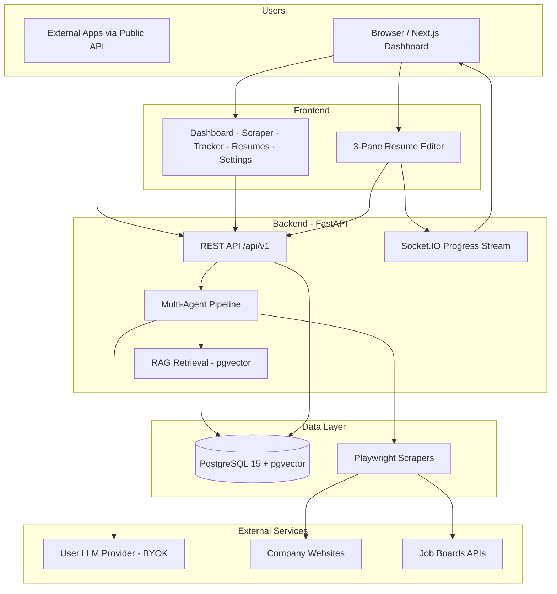
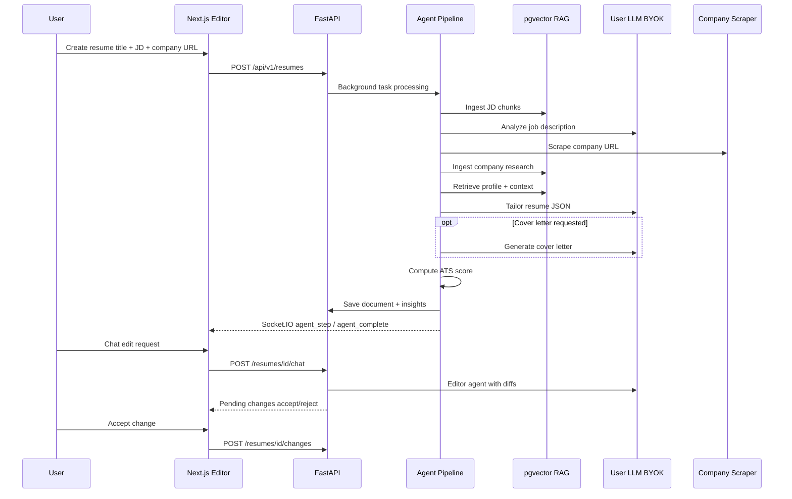
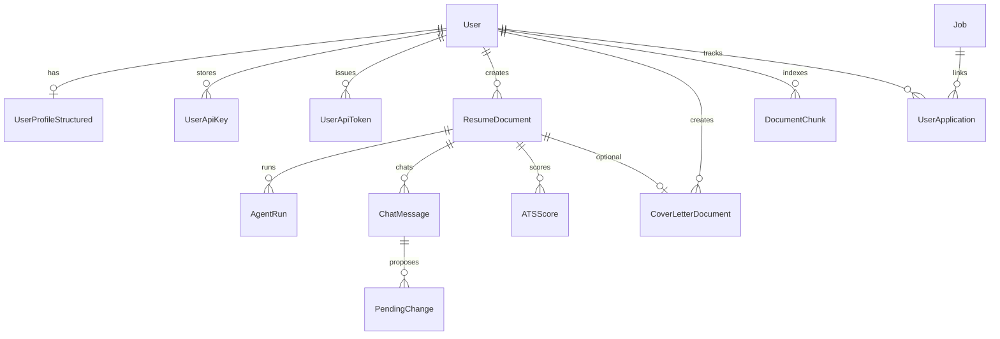

# JobPilot

[](LICENSE)
[](docker-compose.yml)
[](frontend/)
[](backend/)

A free, open-source **job search command centre** for tech professionals. JobPilot aggregates remote job listings, tracks applications on a Kanban board, and now includes a **Cursor-style AI resume builder** — tailor resumes and cover letters per job with multi-agent RAG, accept/reject diffs, and ATS scoring.

> **Paste a job URL, we do the rest.** The URL importer auto-fills job details. The resume builder researches the company, analyzes the JD, and tailors your documents professionally.

---

## Features

### Job Search & Tracking

| Feature | Description |
|---------|-------------|
| **Job Scraper** | RemoteOK, WeWorkRemotely, and Hacker News with smart deduplication |
| **Canada Filter** | Surfaces Canada-eligible remote roles automatically |
| **Kanban Tracker** | Drag-and-drop: To Apply → Applied → Interviewing → Offer → Rejected |
| **URL Importer** | Paste any careers page URL to auto-fill job details (Playwright) |
| **Resume Match** | TF-IDF keyword matching with visible matched keywords |
| **Analytics** | Application trends, interview rate, status breakdown (Chart.js) |

### AI Resume & Cover Letter Builder

| Feature | Description |
|---------|-------------|
| **Multi-Agent Pipeline** | JD analyzer → company researcher → resume writer → cover letter → ATS scorer |
| **RAG Context** | pgvector embeddings over profile, uploaded PDFs, job descriptions, and company research |
| **Cursor-Style Editor** | 3-pane UI: AI chat with accept/reject diffs, live preview, structured section editor |
| **Dual Preview** | Fast HTML preview in editor + LaTeX source view + PDF export |
| **Cover Letters** | Optional cover letter with hiring manager, address, and additional context |
| **ATS Scoring** | Keyword match, formatting score, missing keywords, and improvement suggestions |
| **BYOK LLM Keys** | Per-user encrypted API keys — OpenAI or any OpenAI-compatible provider |
| **Public API** | REST endpoints with `X-API-Key` for external integrations |
| **Projects Section** | Dedicated projects block in structured profile and editor (beyond typical builders) |

### Platform

| Feature | Description |
|---------|-------------|
| **Dark UI** | Premium zinc/indigo dashboard inspired by Linear and Supabase |
| **OAuth** | Google and GitHub sign-in (optional in dev) |
| **Open Source** | MIT licensed — self-host with your own LLM keys |

---

## High-Level Architecture



---

## Low-Level: Resume Generation Flow



---

## Low-Level: Data Model



---

## Quick Start (Docker)

```bash
git clone https://github.com/NevilPatel01/JobPilot.git
cd JobPilot
cp backend/.env.example backend/.env
cp frontend/.env.local.example frontend/.env.local
docker compose up --build
```

| Service | URL |
|---------|-----|
| Frontend | http://localhost:3000 |
| Backend API | http://localhost:8000/api/v1/health |
| API Docs | http://localhost:8000/docs |
| PostgreSQL | localhost:5432 |

Dev mode runs with `AUTH_DISABLED=true` — no OAuth setup required for local testing.

### First-time setup for AI features

1. Open **API Settings** (`/settings`) and add your LLM API key (OpenAI or compatible).
2. Fill your **User Profile** (`/profile`) with structured experience, education, projects, and skills.
3. Click **Create New** → paste a job description → optionally add company URL and cover letter details.
4. Open the resume in the editor — chat to refine, accept/reject AI diffs, export PDF.

> **pgvector:** Docker Compose uses `pgvector/pgvector:pg15`. If upgrading from plain Postgres, recreate the `postgres_data` volume.

---

## Public API

Generate an API token in **Settings**, then call:

```bash
# Create and generate a tailored resume (optional webhook_url for completion callback)
curl -X POST http://localhost:8000/api/v1/documents/resumes \
  -H "X-API-Key: jp_your_token_here" \
  -H "Content-Type: application/json" \
  -d '{
    "title": "Senior Engineer at Stripe",
    "job_description": "Paste full JD here...",
    "company_url": "https://stripe.com",
    "source_type": "profile",
    "webhook_url": "https://your-app.example/hooks/jobpilot"
  }'

# Get resume status and content
curl http://localhost:8000/api/v1/documents/resumes/{id} \
  -H "X-API-Key: jp_your_token_here"

# Interactive chat edit
curl -X POST http://localhost:8000/api/v1/documents/resumes/{id}/chat \
  -H "X-API-Key: jp_your_token_here" \
  -H "Content-Type: application/json" \
  -d '{"message": "Make the first bullet more metrics-driven"}'

# ATS score
curl -X POST http://localhost:8000/api/v1/documents/resumes/{id}/ats-score \
  -H "X-API-Key: jp_your_token_here"
```

Public API endpoints are rate-limited (10 creates/minute, 60 other requests/minute per API key by default). When `webhook_url` is provided on create, JobPilot POSTs a JSON payload on pipeline completion or failure so you can avoid polling.

See [CONTRIBUTING.md](CONTRIBUTING.md#pipeline-durability) for how background jobs behave on restart and how to recover stuck pipelines.

---

## Local Development (without Docker)

```bash
# Start Postgres only
docker compose up postgres -d

# Backend
cd backend
python -m venv .venv && source .venv/bin/activate
pip install -r requirements.txt
cp .env.example .env
uvicorn app.main:socket_app --reload --port 8000

# Frontend
cd frontend
npm install
cp .env.local.example .env.local
npm run dev
```

Or use the helper script:

```bash
./scripts/dev.sh
```

---

## Environment Variables

### Backend (`backend/.env`)

| Variable | Description |
|----------|-------------|
| `DATABASE_URL` | PostgreSQL connection string (asyncpg) |
| `SECRET_KEY` | JWT signing key + BYOK encryption — generate a random 256-bit value |
| `ALLOWED_ORIGINS` | Comma-separated CORS origins |
| `GOOGLE_CLIENT_ID` | Google OAuth client ID (optional) |
| `GITHUB_CLIENT_ID` | GitHub OAuth client ID (optional) |
| `AUTH_DISABLED` | Set `true` for local dev without OAuth |
| `SCRAPER_DEBOUNCE_MINUTES` | Min minutes between manual scrapes (default: 10) |

### Frontend (`frontend/.env.local`)

| Variable | Description |
|----------|-------------|
| `NEXTAUTH_URL` | App URL (e.g. `http://localhost:3000`) |
| `NEXTAUTH_SECRET` | NextAuth secret — generate a random value |
| `NEXT_PUBLIC_API_URL` | Backend URL (e.g. `http://localhost:8000`) |
| `NEXT_PUBLIC_HIRE_ME_URL` | URL for the **Hire Me** button (LinkedIn, portfolio, etc.) |
| `GOOGLE_CLIENT_ID` / `GOOGLE_CLIENT_SECRET` | Google OAuth (optional) |
| `GITHUB_ID` / `GITHUB_SECRET` | GitHub OAuth (optional) |
| `AUTH_DISABLED` / `NEXT_PUBLIC_AUTH_DISABLED` | Skip OAuth in dev |

Never commit `.env` or `.env.local` files. Use the `.example` files as templates.

### PDF Export

PDF export compiles LaTeX server-side via [Tectonic](https://tectonic-typesetting.github.io/). The backend Docker image installs Tectonic automatically. For local dev without Docker, install Tectonic on your host. HTML preview works without it.

---

## Project Structure

```
JobPilot/
├── backend/
│   ├── app/
│   │   ├── agents/          # Multi-agent resume generation pipeline
│   │   ├── api/routes/      # REST endpoints (resumes, settings, documents)
│   │   ├── models/          # SQLAlchemy models + pgvector chunks
│   │   ├── services/
│   │   │   ├── rag/         # Chunking, embedding, retrieval
│   │   │   ├── llm/         # BYOK LLM client factory
│   │   │   └── resume/      # HTML/LaTeX render, PDF compile
│   │   └── scrapers/        # Job boards + company research
│   └── alembic/             # Database migrations
├── frontend/
│   ├── app/(dashboard)/
│   │   ├── resumes/         # List, create, editor, ATS review
│   │   ├── cover-letters/   # Cover letter management
│   │   └── settings/        # BYOK keys + API tokens
│   └── components/resume/   # Editor, preview, structured forms
└── docker-compose.yml       # Postgres (pgvector) + backend + frontend
```

---

## Deployment

JobPilot can be deployed to Railway, Render, or Fly.io:

1. Provision PostgreSQL with **pgvector** extension (or use `pgvector/pgvector` Docker image)
2. Deploy the backend with environment variables from the table above
3. Deploy the frontend with `NEXT_PUBLIC_API_URL` pointing to your backend
4. Set `AUTH_DISABLED=false` and configure OAuth providers for production
5. Users bring their own LLM API keys via Settings — no server-side OpenAI bill

For self-hosting, use `docker compose up` on any VPS with Docker installed.

---

## Roadmap

See [ROADMAP.md](ROADMAP.md). Recent additions: multi-agent resume builder, cover letters, ATS scoring, public API, and RAG with pgvector.

---

## Contributing

See [CONTRIBUTING.md](CONTRIBUTING.md). Pull requests use **GitHub Copilot** for automated code review. The most impactful contributions:

- New job scraper sources
- Additional LaTeX resume templates
- LLM provider adapters
- ATS scoring improvements

---

## Author

Built by [Nevil Patel](https://github.com/NevilPatel01). Like what you see? Use the **Hire Me** button in the app sidebar.

---

## License

[MIT](LICENSE) — free forever.
