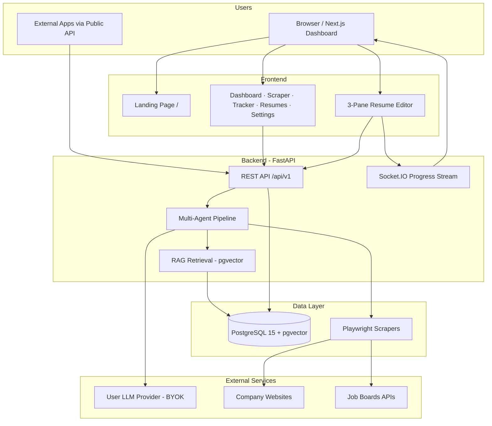

# JobPilot

[](LICENSE)
[](docker-compose.yml)
[](frontend/)
[](backend/)

A free, open-source **job search command centre** for tech professionals. JobPilot aggregates remote job listings, tracks applications on a Kanban board, and includes an **AI resume builder** — tailor resumes and cover letters per job with multi-agent RAG, accept/reject diffs, and ATS scoring.

> **Paste a job URL, we do the rest.** The URL importer auto-fills job details. The resume builder researches the company, analyzes the JD, and tailors your documents professionally.

---

## Features

### Job Search & Tracking

| Feature | Description |
|---------|-------------|
| **Job Scraper** | RemoteOK, WeWorkRemotely, and Hacker News with smart deduplication |
| **Canada Filter** | Surfaces Canada-eligible remote roles automatically |
| **Kanban Tracker** | Drag-and-drop: To Apply → Applied → Interviewing → Offer → Rejected |
| **URL Importer** | Paste any careers page URL to auto-fill job details (Playwright) |
| **Resume Match** | TF-IDF keyword matching with visible matched keywords |
| **Analytics** | Application trends, interview rate, status breakdown (Chart.js) |

### AI Resume & Cover Letter Builder

| Feature | Description |
|---------|-------------|
| **Multi-Agent Pipeline** | JD analyzer → company researcher → resume writer → cover letter → ATS scorer |
| **RAG Context** | pgvector embeddings over profile, uploaded PDFs, job descriptions, and company research |
| **3-Pane Editor** | AI chat with accept/reject diffs, LaTeX source + live PDF preview, structured section editor |
| **LaTeX PDF Preview** | Jake's Resume template compiled via Tectonic — pixel-accurate preview, not HTML approximation |
| **Cover Letters** | Optional cover letter with hiring manager, address, and additional context |
| **ATS Scoring** | Keyword match, formatting score, missing keywords, and improvement suggestions |
| **BYOK LLM Keys** | Per-user encrypted API keys — OpenAI, Anthropic (Claude), or OpenAI-compatible providers |
| **Smart Model Selection** | Preset dropdown with **Auto** mode picks cost-efficient models for your API key |
| **Public API** | REST endpoints with `X-API-Key` for external integrations |
| **Projects Section** | Dedicated projects block in structured profile and editor (beyond typical builders) |

### Platform

| Feature | Description |
|---------|-------------|
| **Landing Page** | Public marketing site at `/` with feature overview and GitHub sign-in CTA |
| **GitHub OAuth** | Production-ready sign-in via NextAuth (Google optional) |
| **Dark UI** | Premium zinc/indigo dashboard inspired by Linear and Supabase |
| **Open Source** | MIT licensed — self-host with your own LLM keys |

---

## High-Level Architecture



---

## Quick Start (Docker)

```bash
git clone https://github.com/NevilPatel01/JobPilot.git
cd JobPilot
cp backend/.env.example backend/.env
cp frontend/.env.local.example frontend/.env.local
docker compose up --build
```

| Service | URL |
|---------|-----|
| Landing | http://localhost:3000 |
| Dashboard | http://localhost:3000/dashboard |
| Backend API | http://localhost:8000/api/v1/health |
| API Docs | http://localhost:8000/docs |
| PostgreSQL | localhost:5432 |

Dev mode runs with `AUTH_DISABLED=true` — no OAuth setup required for local testing.

### First-time setup for AI features

1. Open **API Settings** (`/settings`) and add your LLM API key (OpenAI or Anthropic).
2. Choose **Auto** for model selection, or pick from the preset dropdown.
3. Fill your **User Profile** (`/profile`) with structured experience, education, projects, and skills.
4. Click **Create New** → paste a job description → optionally add company URL and cover letter details.
5. Open the resume in the editor — chat to refine, accept/reject AI diffs, preview LaTeX PDF, export.

> **pgvector:** Docker Compose uses `pgvector/pgvector:pg15`. If upgrading from plain Postgres, recreate the `postgres_data` volume.

---

## Production Deployment

### 1. GitHub OAuth App

Create an OAuth App at [GitHub Developer Settings](https://github.com/settings/developers):

| Field | Value |
|-------|-------|
| Homepage URL | `https://your-domain.com` |
| Authorization callback URL | `https://your-domain.com/api/auth/callback/github` |

### 2. Environment Variables

**Frontend (`frontend/.env.local` or Docker env):**

| Variable | Production value |
|----------|------------------|
| `AUTH_DISABLED` | `false` |
| `NEXT_PUBLIC_AUTH_DISABLED` | `false` |
| `NEXTAUTH_URL` | `https://your-domain.com` |
| `NEXTAUTH_SECRET` | Random 32+ char secret |
| `GITHUB_ID` | GitHub OAuth client ID |
| `GITHUB_SECRET` | GitHub OAuth client secret |
| `NEXT_PUBLIC_API_URL` | `https://api.your-domain.com` |

**Backend (`backend/.env`):**

| Variable | Production value |
|----------|------------------|
| `AUTH_DISABLED` | `false` |
| `SECRET_KEY` | Random 256-bit secret (JWT + key encryption) |
| `ALLOWED_ORIGINS` | `https://your-domain.com` |

### 3. Deploy

1. Provision PostgreSQL with **pgvector** extension
2. Deploy backend with Tectonic available (included in Docker image) for PDF preview
3. Deploy frontend with OAuth env vars
4. Users bring their own LLM API keys via Settings

For self-hosting, use `docker compose up` on any VPS with Docker installed.

---

## Public API

Generate an API token in **Settings**, then call:

```bash
curl -X POST http://localhost:8000/api/v1/documents/resumes \
  -H "X-API-Key: jp_your_token_here" \
  -H "Content-Type: application/json" \
  -d '{
    "title": "Senior Engineer at Stripe",
    "job_description": "Paste full JD here...",
    "company_url": "https://stripe.com",
    "source_type": "profile"
  }'
```

Public API endpoints are rate-limited (10 creates/minute, 60 other requests/minute per API key by default).

See [CONTRIBUTING.md](CONTRIBUTING.md#pipeline-durability) for background job behavior on restart.

---

## Local Development (without Docker)

```bash
docker compose up postgres -d
./scripts/dev.sh
```

Or manually:

```bash
# Backend
cd backend && python -m venv .venv && source .venv/bin/activate
pip install -r requirements.txt && cp .env.example .env
uvicorn app.main:socket_app --reload --port 8000

# Frontend
cd frontend && npm install && cp .env.local.example .env.local
npm run dev
```

---

## Environment Variables

### Backend (`backend/.env`)

| Variable | Description |
|----------|-------------|
| `DATABASE_URL` | PostgreSQL connection string (asyncpg) |
| `SECRET_KEY` | JWT signing key + BYOK encryption |
| `ALLOWED_ORIGINS` | Comma-separated CORS origins |
| `AUTH_DISABLED` | `true` for local dev without OAuth |

### Frontend (`frontend/.env.local`)

| Variable | Description |
|----------|-------------|
| `NEXTAUTH_URL` | App URL (e.g. `http://localhost:3000`) |
| `NEXTAUTH_SECRET` | NextAuth secret |
| `GITHUB_ID` / `GITHUB_SECRET` | GitHub OAuth (required for production) |
| `GOOGLE_CLIENT_ID` / `GOOGLE_CLIENT_SECRET` | Google OAuth (optional) |
| `NEXT_PUBLIC_API_URL` | Backend URL |
| `AUTH_DISABLED` / `NEXT_PUBLIC_AUTH_DISABLED` | Skip OAuth in dev |

Never commit `.env` or `.env.local` files.

### PDF Preview

PDF preview compiles LaTeX server-side via [Tectonic](https://tectonic-typesetting.github.io/). The backend Docker image installs Tectonic automatically. For local dev without Docker, install Tectonic on your host.

---

## Project Structure

```
JobPilot/
├── frontend/
│   ├── app/(marketing)/     # Public landing page at /
│   ├── app/(dashboard)/     # Authenticated app (/dashboard, /resumes, …)
│   └── components/
│       ├── marketing/       # Landing page sections
│       └── resume/          # LaTeX editor, PDF preview, structured forms
├── backend/
│   ├── app/services/llm/    # BYOK client, model auto-selection
│   └── app/services/resume/ # LaTeX render, Tectonic PDF compile
└── docker-compose.yml
```

---

## Job Intelligence + Capture (v0.4 — Ready to Build)

JobPilot is evolving into a **Canadian job acquisition engine** focused on AB, BC, ON, and SK: inbox-first workflow, weighted fit scoring for work-permit holders targeting PR, multi-source ingestion, Chrome extension capture, and application analytics tied to the AI resume builder.

| Document | Purpose |
|----------|---------|
| [JOB_INTELLIGENCE_PLAN.md](JOB_INTELLIGENCE_PLAN.md) | Architecture, data models, phases |
| [JOB_INTELLIGENCE_QUESTIONS.md](JOB_INTELLIGENCE_QUESTIONS.md) | Confirmed decisions record |
| [ROADMAP.md](ROADMAP.md) | Version milestones |

**Database:** PostgreSQL + pgvector only. **Ship order:** Inbox → Fit scoring → Resume from inbox → Canadian APIs → Extension → Watchlist → Gmail → Analytics.

---

## Roadmap

See [ROADMAP.md](ROADMAP.md).

---

## Contributing

See [CONTRIBUTING.md](CONTRIBUTING.md). Pull requests use **GitHub Copilot** for automated code review.

---

## Author

Built by [Nevil Patel](https://github.com/NevilPatel01). Like what you see? Use the **Hire Me** button in the app sidebar.

---

## License

[MIT](LICENSE) — free forever.
